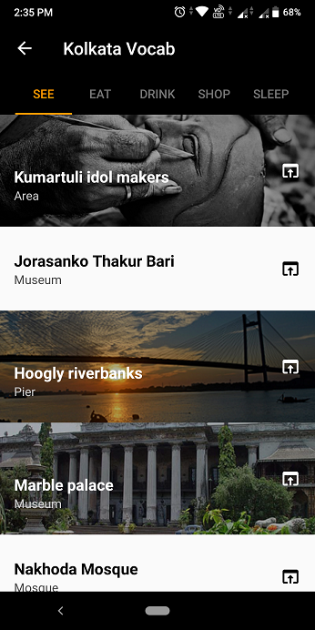

# Kolkata Vocab
### A tour guide for Kolkata
This is a simple and easy to use tour guide app for the popular Indian city **Kolkata**.
You can find all popular places differentiated in categories such as *SEE*, *EAT*, *DRINK*, *SHOP* and *SLEEP*.

## Ssreenshots

 

## Pre-requisites
* Android SDK v23
* Android Support Design v28

## Instructions
Before running the app on your android device **check** if the following lines are present inside the **dependencies** section in the **AndroidManifest.xml** file in the project directory, if not then make sure too add them inside the **dependencies** section.

* implementation 'com.android.support:support-v4:28.0.0'
* implementation 'com.android.support:design:28.0.0'
* implementation 'com.robertlevonyan.view:CustomFloatingActionButton:2.1.0'